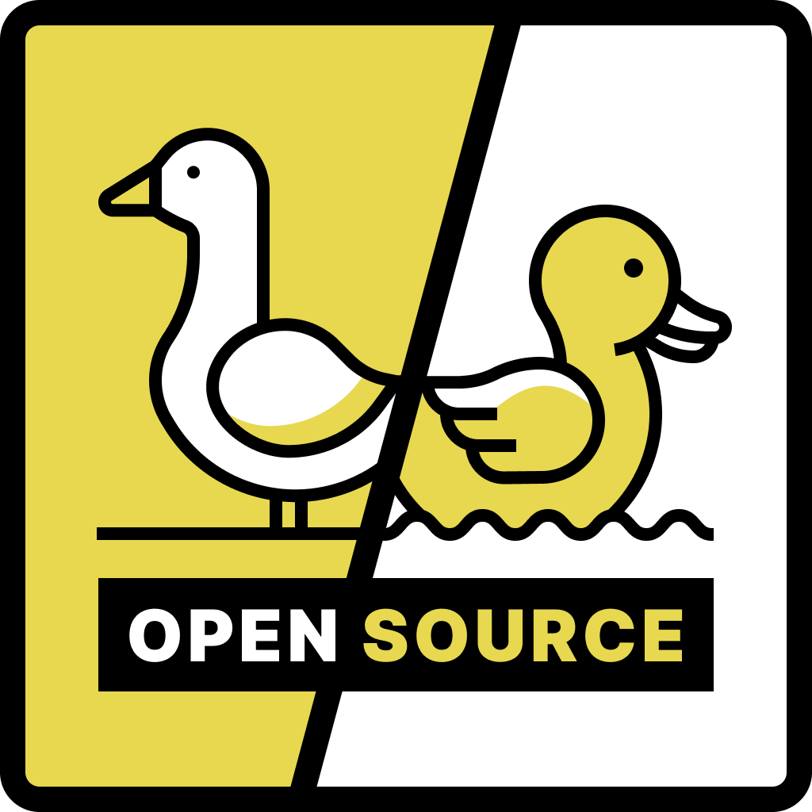

# Подкаст Goose&Duck

Тут два представителя птичьих и по совместительству опенсорсеры рассказывают про разные-разности связанные с коммьюнити открытого исходного кода.

## Ведущие

- The Goose: [Дима Коваленко](https://twitter.com/dmtrKovalenko)
- The Duck: [Влад Шилов](https://twitter.com/Omgovich)

## Ссылки

- [Apple Podcasts](https://podcasts.apple.com/ua/podcast/goose-duck-opensource/id1573208350?l=ru)
- [Google Podcasts](https://www.google.com/podcasts?feed=aHR0cHM6Ly9hbmNob3IuZm0vcy81YzVjNGE0OC9wb2RjYXN0L3Jzcw==)
- [YouTube](https://www.youtube.com/channel/UCTFSF1qHRod0YdQ8hYYW3nA)
- [Anchor](https://anchor.fm/goose-duck/episodes/GooseDuck---Babel-e11dnho)
- [Breaker](https://www.breaker.audio/goose-and-duck-opensource)
- [Pocket Casts](https://pca.st/r6dhyjgf)
- [RadioPublic](https://radiopublic.com/gooseduck-opensource-WejlQv)
- [RSS](https://anchor.fm/s/5c5c4a48/podcast/rss)

## Выпуски

- [#3 — UI-дизайн-framework-системы](episodes/003.md)
- [#2 — Промежуточные сорсмапы](episodes/002.md)
- [#1 — Ржавеющий JavaScript](episodes/001.md)
- [#0 — Babel, деньги, два гуся](episodes/000.md)
